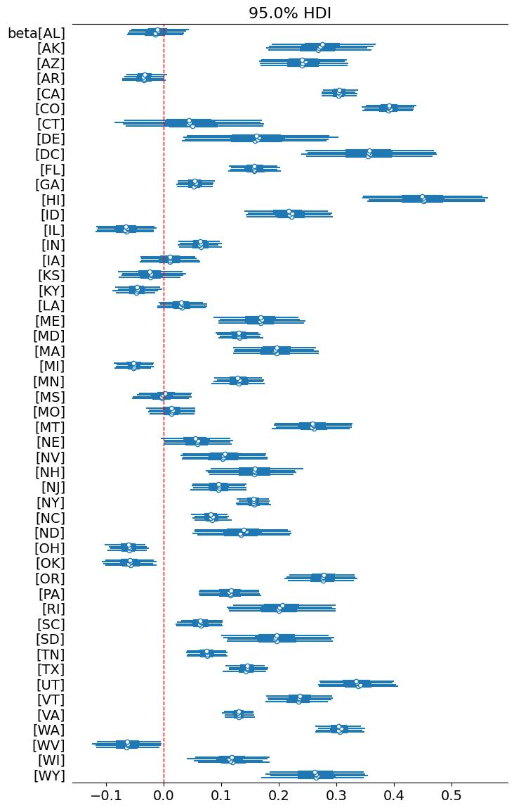

# Does LIHTC Development Affect Local Housing Costs?

**A Bayesian hierarchical analysis of America's largest affordable-housing program**

The Low-Income Housing Tax Credit (LIHTC) is the largest affordable-housing program in the
United States — ~$10.5B/year and 3.7M+ units since 1986 — yet it's often discussed in policy
debates with little empirical grounding. This project asks a focused question: **as a county
builds more LIHTC units, what happens to its home values and rents?**

I model this with a **Bayesian hierarchical (partial-pooling) regression** — county-level
intercepts and state-level slopes — so counties are treated as correlated samples *within*
their state rather than as 50-state-blind independent draws. After controlling for population
growth and deflating prices by CPI-less-shelter, I find a **modest positive association**:

| Outcome | Association per 1% ↑ in cumulative LIHTC per capita | 95% HDI |
|---|---|---|
| Home values (ZHVI) | **+0.13%** | [0.09%, 0.17%] |
| Rents (ZORI) | **+0.32%** | [0.29%, 0.36%] |

The positive sign is counterintuitive (more rental supply, higher rents) and most likely
reflects **where credits get allocated** — high-demand, high-growth markets — rather than a
causal price effect. The effect varies sharply by state, which is the core argument for the
hierarchical structure and for addressing housing policy at the state/local level.

<p align="center">
  <br>
  <em>State-level LIHTC slopes (home-value model), 95% HDI. Some states straddle zero;
  others (HI, DC, CA, CO, UT) are strongly positive — the heterogeneity a pooled model
  would erase.</em>
</p>

📄 **[Read the full write-up (PDF)](reports/LIHTC_Bayesian_Analysis_Report.pdf)** — ISyE 6420, Georgia Tech.

---

## What this project demonstrates

**Bayesian / statistical modeling**
- Hierarchical (partial-pooling) model with county intercepts and **state-varying slopes**,
  built in **PyMC**.
- Weakly- and informatively-specified priors (e.g. `β0 ~ Normal(12, τ=0.25)` informed by the
  empirical log-price distribution; tighter `τ_α` priors to stabilize the sparse rental panel).
- **MCMC diagnostics**: trace plots, R-hat ≈ 1.00, and bulk/tail ESS reported for every
  parameter.
- Formal **model comparison via LOO** (leave-one-out cross-validation / ELPD), which decisively
  favors the inflation-adjusted hierarchical specification over pooled and nominal alternatives.
- Where Bayesian inference shines: the rental panel is *sparse* (many counties with only a few
  years), and partial pooling + a data-informed prior let the model still recover credible
  county/state effects.

**End-to-end data engineering**
- Merged **six messy public datasets** into two clean analysis panels, joined on county **FIPS**:
  - HUD LIHTC project database (54k+ projects, 1987–2023)
  - Zillow Home Value Index (ZHVI) and Observed Rent Index (ZORI), monthly → annualized
  - U.S. Census Bureau population estimates (three different vintages: intercensal 2000–09,
    2010–19, and 2020–23 via USDA ERS)
  - FRED CPI "All Items Less Shelter" for inflation adjustment (deliberately *excluding*
    shelter to avoid conditioning on the outcome)
- Feature engineering: **cumulative** LIHTC units (supply persists across years) scaled
  **per 1,000 residents**, plus real (inflation-deflated) price indices.
- Documented data-quality decisions — e.g. ~21% of LIHTC projects dropped for invalid county
  FIPS, ZORI restricted to counties with 5+ valid years.

---

## Results at a glance

- **Inflation matters a lot.** The nominal home-value association (~0.40%) collapses to ~0.13%
  once prices are deflated — most of the raw relationship was just dollar debasement. LOO
  confirms the inflation-adjusted model is strongly preferred (weight ≈ 0.99).
- **State heterogeneity is real.** High-cost/high-demand states (HI, CA, CO) show the strongest
  positive slopes; several lower-cost states (OH, OK) have 95% credible intervals overlapping
  zero. A single pooled slope would hide this.
- **Rents respond more than home values** (0.32% vs. 0.13%), consistent with LIHTC being a
  rental program — but the positive sign points to allocation/demand confounding, not a supply
  effect.
- **Not causal.** This is an observational association; the most likely story is that credits
  flow to markets with demonstrated need (job/wage growth, zoning) beyond what population growth
  captures.

---

## Repository structure

```
.
├── notebooks/                       # run in numeric order
│   ├── 01_build_population_data.ipynb   # Census vintages → unified county panel
│   ├── 02_build_inflation_data.ipynb    # FRED CPI → annual deflator
│   ├── 03_build_panels.ipynb            # join LIHTC + Zillow + pop → housing & rental panels
│   ├── 04_housing_value_models.ipynb    # ZHVI: pooled vs. hierarchical, LOO, diagnostics
│   └── 05_rental_models.ipynb           # ZORI: same workflow on the sparse rental panel
├── data/
│   ├── raw/                         # source files from HUD, Zillow, Census, FRED
│   └── processed/                   # analysis-ready panels built by 01–03
├── reports/
│   ├── LIHTC_Bayesian_Analysis_Report.pdf
│   └── figures/                     # trace, forest, and posterior plots
└── requirements.txt
```

## Reproducing

```bash
python -m venv .venv && source .venv/bin/activate
pip install -r requirements.txt
jupyter lab            # run notebooks/ 01 → 05 in order
```

Notebooks read from `data/raw/`, write intermediate panels to `data/processed/`, and save
figures to `reports/figures/`.

## Methods & tools

`PyMC` · `ArviZ` · `pandas` · `NumPy` · `matplotlib` — Bayesian hierarchical modeling, MCMC
(NUTS), LOO/ELPD model comparison, posterior/HDI inference.

## Next steps

- **Toward causality:** instrument LIHTC allocation (e.g. Qualified Census Tract eligibility,
  per-capita credit ceilings) or a difference-in-differences / event-study design around
  project completion dates.
- **Richer demand controls:** add job and wage growth, vacancy rates, and zoning/permitting
  measures so the slope isn't absorbing unobserved demand.
- **Spatial structure:** spatial random effects or distance-decay so neighboring counties
  inform each other, not just same-state counties.
- **Dose & timing:** distributed-lag specification to separate construction-period effects from
  the persistent supply effect.

## Data sources

HUD LIHTC Database · Zillow Research (ZHVI, ZORI) · U.S. Census Bureau Population Estimates ·
USDA ERS · FRED (St. Louis Fed, series `CUUR0000SA0L2`). Full citations in the
[report](reports/LIHTC_Bayesian_Analysis_Report.pdf).

---

*Originally completed as the term project for ISyE 6420 (Bayesian Statistics), Georgia Institute
of Technology, Spring 2026.*
