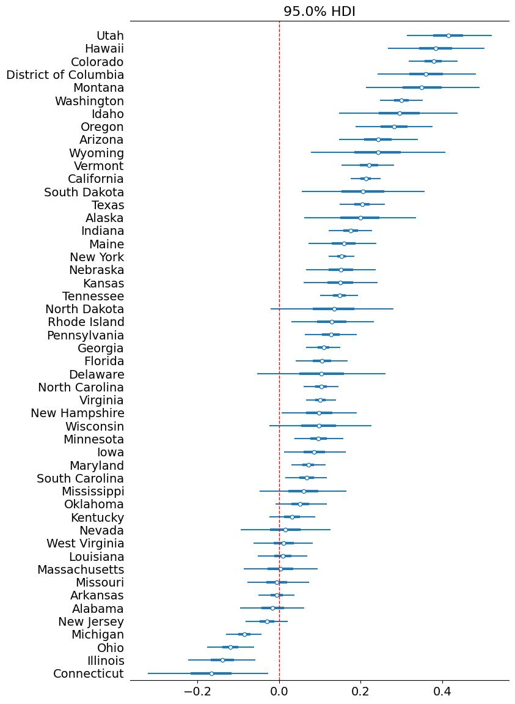

# Does Building Affordable Housing Raise Local Rents?

**A Bayesian hierarchical analysis of America's largest affordable-housing program**

Housing affordability has become a major political talking point, and the debate usually
centers on market-rate housing. When affordable housing programs do come up, they tend to be
criticized with little empirical evidence behind the claim. I wanted to measure the actual
relationship between the Low-Income Housing Tax Credit (LIHTC) and local housing costs. LIHTC
is the largest affordable-housing program in the country (about $10.5B/year and 3.7M+ units
since 1986), which makes it the natural place to ask the question: as a county builds more
LIHTC units, what happens to its home values and rents?

The effect turns out to be local rather than national. State coefficients vary enough that
"the national effect of LIHTC" is the wrong question to ask. After controlling for population
growth and deflating prices with CPI-less-shelter, I find a modest positive association.

| Outcome | Association per 1% more LIHTC per capita | 95% HDI |
|---|---|---|
| Home values (ZHVI) | **+0.126%** | [0.081%, 0.167%] |
| Rents (ZORI) | **+0.375%** | [0.314%, 0.434%] |

I model this with a **Bayesian hierarchical (partial-pooling) regression**: county intercepts
nested in state intercepts, and state-level slopes, so each county borrows strength from its
own state instead of collapsing into one national average. The positive sign is the part worth
sitting with. More rental supply should lower rents, so the result more likely reflects where
credits get allocated (high-demand, high-growth markets) than a price effect of the units
themselves.

<p align="center">
  <br>
  <em>Each row is a state's posterior LIHTC slope on home values, 95% HDI. Utah, Hawaii, and
  Colorado run highest, 14 states include zero, and Michigan, Ohio, Illinois, and Connecticut
  are credibly negative.</em>
</p>

📄 **[Read the full write-up (PDF)](reports/LIHTC_Bayesian_Analysis_Report.pdf)**

---

## What this project demonstrates

**Bayesian / statistical modeling**
- Hierarchical (partial-pooling) model with county intercepts **nested in state intercepts**
  and **state-varying slopes**, built in **PyMC** in non-centered form.
- Priors set from the data where it helps. `β0 ~ Normal(12, τ=0.25)` comes from the empirical
  log-price distribution, and a tighter `τ_α` prior stabilizes the sparse rental panel.
- **MCMC diagnostics** for every parameter: trace plots, R-hat, and bulk/tail ESS. The
  non-centered form took the home-value model from 49 of 2,180 parameters with R-hat above
  1.01 to none, with no divergences.
- Formal **model comparison via LOO** (leave-one-out cross-validation, ELPD), which picks the
  inflation-adjusted nested model over national intercepts, nominal prices, and full pooling.
- The rental panel is sparse (many counties with only a few years), which is exactly where
  partial pooling and a data-informed prior earn their keep. The model still recovers credible
  county and state effects.

**End-to-end data engineering**
- Joined **five public datasets** into two clean analysis panels on county **FIPS**:
  - HUD LIHTC project database (54k+ projects, 1987 to 2023)
  - Zillow Home Value Index (ZHVI) and Observed Rent Index (ZORI), monthly to annual
  - Census Bureau population estimates across three vintages (intercensal 2000 to 2009,
    2010 to 2019, and 2020 to 2023 via USDA ERS)
  - FRED CPI "All Items Less Shelter", chosen to deflate prices without conditioning on the
    outcome I'm trying to measure
- Feature engineering: **cumulative** LIHTC units (supply persists across years) scaled
  **per 1,000 residents**, plus real (inflation-deflated) price indices.
- Documented the data-quality calls. About 21% of LIHTC projects dropped for invalid county
  FIPS, and New Mexico drops out entirely because HUD masks its project locations. The panels
  cover 11,481 (home values) and 2,516 (rents) county-years.

---

## Results at a glance

- **Inflation drives most of the raw signal.** The nominal home-value association (0.400%)
  drops to 0.126% once prices are deflated, and the rent association drops from 0.644% to
  0.375%. LOO prefers the inflation-adjusted model by 1,674.75 ± 46.06 ELPD for home values.
- **State heterogeneity is real.** For home values, 32 states are credibly positive, 14
  include zero, and 4 are credibly negative (Michigan, Ohio, Illinois, Connecticut). Utah,
  Hawaii, and Colorado show the strongest positive slopes. For rents, 46 states are credibly
  positive and 4 include zero. A single pooled slope hides all of this.
- **Intercepts have to pool by state too.** The first version pooled county intercepts toward
  one national mean while slopes pooled by state, which could let part of a state's price
  level load onto its slope. Nesting the intercepts in states improved LOO by 121.63 ± 14.52 ELPD (home
  values) and 104.90 ± 9.98 (rents).
- **Rents respond more than home values** (0.375% vs. 0.126%), which fits LIHTC being a rental
  program. The positive sign still points to allocation and demand confounding, not a supply
  effect.
- **Not causal.** This is an observational association. The most likely story is that credits
  flow to markets with demonstrated need (job growth, wage growth, zoning) beyond what
  population growth captures.

---

## Repository structure

```
.
├── notebooks/                       # run in numeric order
│   ├── 01_build_population_data.ipynb   # Census vintages into a unified county panel
│   ├── 02_build_inflation_data.ipynb    # FRED CPI into an annual deflator
│   ├── 03_build_panels.ipynb            # join LIHTC + Zillow + pop into housing & rental panels
│   ├── 04_housing_value_models.ipynb    # ZHVI: pooled vs. hierarchical, LOO, diagnostics
│   ├── 05_rental_models.ipynb           # ZORI: same workflow on the sparse rental panel
│   └── 06_presentation_figures.ipynb    # slide figures from the saved summaries (no sampling)
├── data/
│   ├── raw/                         # source files from HUD, Zillow, Census, FRED
│   └── processed/                   # analysis-ready panels built by 01 to 05
├── reports/
│   ├── LIHTC_Bayesian_Analysis_Report.pdf
│   ├── figures/                     # trace, forest, and posterior plots
│   │   └── presentation/            # slide figures from 06
│   └── summaries/                   # posterior summaries written by 04 and 05
└── requirements.txt
```

## Reproducing

```bash
python -m venv .venv && source .venv/bin/activate
pip install -r requirements.txt
jupyter lab            # run notebooks/ 01 to 06 in order
```

Notebooks read from `data/raw/`, write intermediate panels to `data/processed/`, and save
figures to `reports/figures/`.

## Methods & tools

`PyMC`, `ArviZ`, `pandas`, `NumPy`, `matplotlib`. Bayesian hierarchical modeling, MCMC (NUTS),
LOO/ELPD model comparison, posterior and HDI inference.

## Next steps

- **Push toward causality.** Instrument LIHTC allocation (Qualified Census Tract eligibility,
  per-capita credit ceilings), or run a difference-in-differences design around project
  completion dates.
- **Add real demand controls.** Job and wage growth, vacancy rates, and zoning/permitting
  measures, so the slope stops absorbing unobserved demand.
- **Model space.** Spatial random effects or distance decay, so neighboring counties inform
  each other rather than only same-state counties.
- **Separate dose from timing.** A distributed-lag specification to split construction-period
  effects from the persistent supply effect.

## Data sources

HUD LIHTC Database, Zillow Research (ZHVI, ZORI), Census Bureau Population Estimates, USDA ERS,
and FRED (St. Louis Fed, series `CUUR0000SA0L2`). Full citations are in the
[report](reports/LIHTC_Bayesian_Analysis_Report.pdf).
